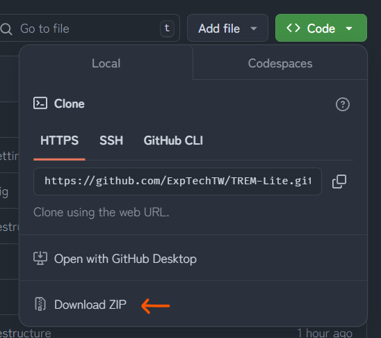

<div align="center">
<a href="https://github.com/ExpTechTW/TREM-Lite/tree/main"></a>
<a href="https://github.com/ExpTechTW/TREM-Lite/releases/latest"></a>
<a href="https://github.com/ExpTechTW/TREM-Lite/actions/workflows/ci.yml"></a>
<a href="https://good-labs.github.io/greater-good-affirmation"></a>

<a href="https://exptech.dev/trem"></a>
<a href="https://discord.gg/5dbHqV8ees"></a>
</div>

## 簡介

TREM 是一款開源地震速報軟體，提供給您即時的地震資訊，利用自製的測站，顯示各地的即時震度，在地震發生的第一時間取得各管道發布的強震即時警報訊息

### 強震即時警報

強震即時警報（Earthquake Early Warning, EEW），是藉由部署於各地之地震波觀測站，在地震發生時將測得之地震波回傳至伺服器計算並產生地震速報，為你爭取數秒甚至數十秒之時間，進行防災應變及避難措施。

### TREM-Net 臺灣即時地震觀測網

TREM-Net 是一個 2022 年 6 月初開始於全臺各地部署站點的專案，由兩個觀測網組成，分別為 **SE-Net**（強震觀測網「加速度儀」）及 **MS-Net**（微震觀測網「速度儀」），共同紀錄地震時的各項數據。

## 資料來源

所有資料皆來自於以下單位：

### 官方來源

- [交通部中央氣象署](https://www.cwa.gov.tw/)
- [國家災害防救科技中心](https://www.ncdr.nat.gov.tw/)

### 非官方來源

- TREM-Net by [ExpTech Studio](https://exptech.dev/)

## 從原始碼編譯

1. 複製或下載存儲庫

   - **下載壓縮檔**

     你可以在 Github 上直接下載存儲庫壓縮檔

     

   - **使用 Git**

     使用以下 git 指令來複製這個專案的原始碼

     ```bash
     git clone https://github.com/ExpTechTW/TREM-Lite.git
     ```

2. 安裝先決條件

   - [Bun](https://bun.sh)（套件管理與執行）
   - [Rust](https://www.rust-lang.org/tools/install)（Tauri 後端）
   - 各平台的 Tauri 系統依賴，請參考 [Tauri Prerequisites](https://tauri.app/start/prerequisites/)

3. 執行 `bun install` 下載前端依賴

4. 開發模式：`bun run tauri dev`

5. 編譯打包：`bun run tauri build`

> TREM-Lite v4 已從 Electron 遷移至 **Bun + Tauri v2 + Vite + React + Tailwind + shadcn**。
> 所有地震警報音效改由 Rust（rodio）在原生進程播放，解決 OBS 視窗擷取音訊異常的問題。
> 舊版 Electron 原始碼保留於 [`legacy/`](legacy/) 目錄作為移植參照。

## 開放原始碼授權

開放原始碼授權資訊請詳見 [LICENSE](LICENSE) 檔案

## Star History

<a href="https://www.star-history.com/#ExpTechTW/TREM-Lite&Date">
 <picture>
   <source media="(prefers-color-scheme: dark)" srcset="https://api.star-history.com/svg?repos=ExpTechTW/TREM-Lite&type=Date&theme=dark" />
   <source media="(prefers-color-scheme: light)" srcset="https://api.star-history.com/svg?repos=ExpTechTW/TREM-Lite&type=Date" />
   
 </picture>
</a>
