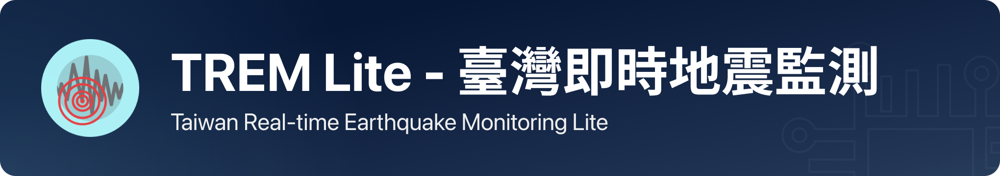

<div align="center">

[](#下載)

**臺灣即時地震監測 —— 即時震度、強震即時警報與地震報告，常駐在你的桌面上。**

[](https://github.com/ExpTechTW/TREM-Lite/releases/latest)
[](https://github.com/ExpTechTW/TREM-Lite/releases)
[](https://github.com/ExpTechTW/TREM-Lite/actions/workflows/ci.yml)
[](https://discord.gg/5dbHqV8ees)

[官網](https://exptech.dev/trem) • [網頁版](https://exptechtw.github.io/TREM-Lite/) • [更新日誌](https://github.com/ExpTechTW/TREM-Lite/releases) • [Commit 規則](commit.md)

</div>

## TREM-Lite 是什麼

TREM（Taiwan Real-time Earthquake Monitoring，臺灣即時地震監測）是臺灣本土團隊 [ExpTech Studio](https://exptech.dev/) 開發的開源地震監測軟體，在地圖上即時顯示各地震度，並在地震發生的第一時間收到各管道發布的強震即時警報。

地震發生時，地震波從震央傳到你所在的位置需要數秒到數十秒。強震即時警報就是在這段時間差裡送出通知 —— 讓你在搖晃抵達之前，還有時間趴下、掩護、穩住。

## 能做什麼

| | |
|---|---|
| **即時震度** | 地圖上即時顯示 TREM-Net 測站的震度，每秒更新 |
| **強震即時警報** | 中央氣象署與 TREM 的地震速報，含所在地的預估震度與 P 波、S 波的傳播範圍 |
| **地震報告** | 中央氣象署最新的地震報告與各地震度，可以重播 |
| **長週期地震動** | 長週期地震動階級的即時資訊 |
| **語音與音效** | 速報、震度與報告的語音播報和提示音。音效在原生程序播放，OBS 視窗擷取不受影響 |
| **通知與子母畫面** | 主視窗隱藏時，以系統通知和子母畫面小視窗提醒 |
| **常駐系統匣** | 關閉視窗後持續監測，也可以隨開機在背景啟動 |
| **自動更新** | 在背景下載新版本，下次啟動時套用，不會打斷正在使用的視窗 |

## 下載

到 [Releases 頁面](https://github.com/ExpTechTW/TREM-Lite/releases/latest)下載正式版：

| 系統 | 檔案 |
|---|---|
| Windows | x64、arm64、32 位元（ia32）的安裝程式（`.exe`） |
| macOS | Apple Silicon（`arm64`）與 Intel（`x64`）各自的 `.dmg` |
| Linux | x64、arm64 的 `.AppImage`、`.deb`、`.rpm` |

不確定 Mac 是哪一種：從「蘋果」選單打開「關於這台 Mac」，顯示「晶片」項目的是 Apple Silicon，下載 `arm64`；顯示「處理器」項目的是 Intel，下載 `x64`（[Apple 說明](https://support.apple.com/zh-tw/116943)）。

不想安裝的話，可以直接用 **[網頁版](https://exptechtw.github.io/TREM-Lite/)**。網頁版有地圖、即時震度、強震即時警報、地震報告和語音播報；音效、系統通知、子母畫面、系統匣常駐與自動更新只有桌面版提供。

### 版本命名

| | 名稱 | 什麼時候出現 |
|---|---|---|
| **正式版** | `26.2` | 手動發布，會透過自動更新推送給所有使用者 |
| **測試版（快照）** | `26w39a` | 每次推上 `main` 自動發布，標示為 Pre-release |

快照以「年份 + 週次 + 當週序號」命名，**不會**透過自動更新推送給正式版使用者 —— 想搶先試用新功能，請到 [Releases](https://github.com/ExpTechTW/TREM-Lite/releases) 手動下載。

## 資料來源

**官方來源**

- [交通部中央氣象署](https://www.cwa.gov.tw/)（CWA）—— 強震即時警報與地震報告
- [國家災害防救科技中心](https://www.ncdr.nat.gov.tw/)（NCDR）

**TREM-Net 臺灣即時地震觀測網**

由 [ExpTech Studio](https://exptech.dev/) 自 2022 年 6 月起在全臺部署，由兩個子系統組成：**SE-Net**（強震觀測網，加速度儀）與 **MS-Net**（微震觀測網，速度儀），共同記錄地震發生時的完整波形。

## 開發

需要 [Bun](https://bun.sh)、[Rust](https://www.rust-lang.org/tools/install)，以及各平台的 [Tauri 系統依賴](https://tauri.app/start/prerequisites/)。

```bash
git clone https://github.com/ExpTechTW/TREM-Lite.git
cd TREM-Lite
bun install
git config core.hooksPath .githooks   # 啟用 commit 規則檢查
```

| 要做什麼 | 指令 |
|---|---|
| 啟動桌面版（開發模式） | `bun run dev` |
| 啟動網頁版 | `bun run dev:web` |
| 建置桌面版 | `bun run build` |
| 建置網頁版 | `bun run build:web` |
| 型別檢查 | `bun run typecheck` |
| Lint | `bun run lint` |
| Rust 測試 | `cargo test --manifest-path apps/desktop/src-tauri/Cargo.toml` |
| 重新產生 `.bin` 資料 | `bun scripts/encode-data.mjs` |

| 目錄 | 內容 |
|---|---|
| `packages/core` | 桌面版與網頁版共用的前端：React、MapLibre、地震資料處理 |
| `apps/desktop` | Tauri 桌面版。Rust 負責音效、HTTP 代理與快取、自動更新、設定與視窗 |
| `apps/web` | 網頁版（GitHub Pages） |
| `tool/` | commit 規則檢查、版本號與發布說明的產生 |
| `legacy/` | 舊版 Electron 原始碼，僅作為移植參照，不再修改 |

> [!NOTE]
> TREM-Lite v4 已從 Electron 遷移到 **Bun + Tauri v2 + Vite + React**。所有 HTTP 請求都經過 Rust 代理，統一處理 ETag 與 gzip；音效改由 Rust（rodio）在原生程序播放。

## 貢獻

- 回報問題或提出建議：[Issues](https://github.com/ExpTechTW/TREM-Lite/issues)
- 提交程式碼：[Fork](https://github.com/ExpTechTW/TREM-Lite/fork) 後發 [Pull Request](https://github.com/ExpTechTW/TREM-Lite/pulls)

**commit 訊息就是更新日誌。** 格式寫在 [commit.md](commit.md)，由 git hook 與 CI 自動檢查 —— 使用者看得到的變更要附上中英文的更新日誌條目，這些條目會原封不動出現在發布說明與 Discord 公告上。

[](https://github.com/ExpTechTW/TREM-Lite/graphs/contributors)

## 合作夥伴

| | |
|---|---|
| [](https://www.geoscience.com.tw/) | [巨科資訊有限公司](https://www.geoscience.com.tw/) 提供開發與測試所需的設備 |
| [](https://www.twds.com.tw/) | [台灣數位串流有限公司](https://www.twds.com.tw/) 提供雲端運算資源、網路頻寬與技術諮詢 |
| [](https://www.thinktronltd.com/) | [興創知能股份有限公司](https://www.thinktronltd.com/) 提供開發與測試所需的設備 |
| | [阿良的嵌入式系統技術學習區](https://jimsun-embedded.blogspot.com/?m=1) 提供開發與測試所需的設備 |

## 授權

[GNU AGPL-3.0](LICENSE)。

## Star History

<a href="https://www.star-history.com/#ExpTechTW/TREM-Lite&Date">
 <picture>
   <source media="(prefers-color-scheme: dark)" srcset="https://api.star-history.com/svg?repos=ExpTechTW/TREM-Lite&type=Date&theme=dark" />
   <source media="(prefers-color-scheme: light)" srcset="https://api.star-history.com/svg?repos=ExpTechTW/TREM-Lite&type=Date" />
   
 </picture>
</a>
